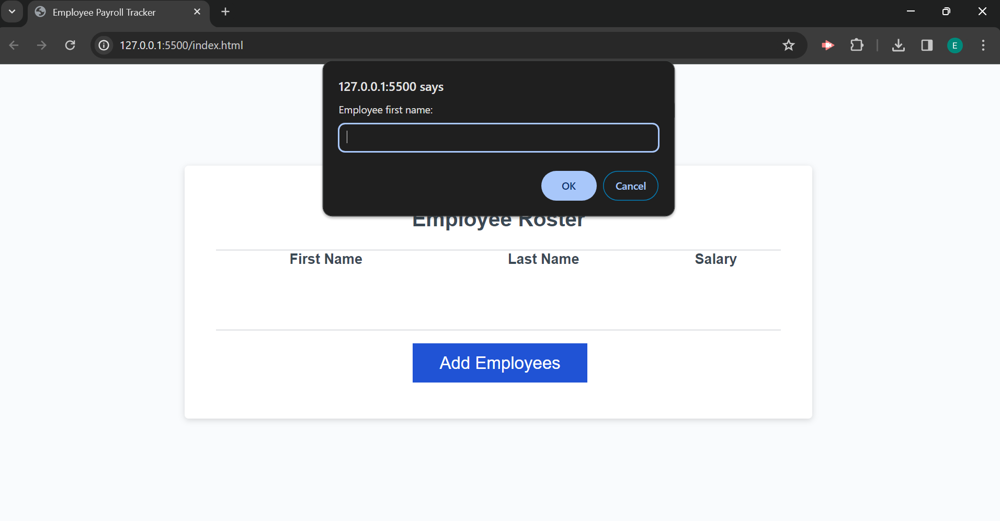
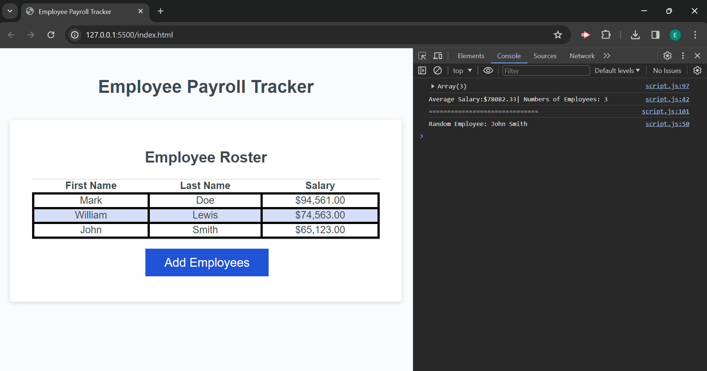

# Employee Payroll Tracker
## Project Description 
 Employee payroll tracker for company to input employee's data and give them a feedback of list of employee, salary average and pick a random employee.

## User Story

```
AS A payroll manager
I WANT AN employee payroll tracker
SO THAT I can see my employees' payroll data and properly budget for the company
```


## Acceptance Criteria

```
GIVEN an employee payroll tracker
WHEN I click the "Add employee" button
THEN I am presented with a series of prompts asking for first name, last name, and salary
WHEN I finish adding an employee
THEN I am prompted to continue or cancel
WHEN I choose to continue
THEN I am prompted to add a new employee
WHEN I choose to cancel
THEN my employee data is displayed on the page sorted alphabetically by last name, and the console shows computed and aggregated data
```

## Website Page Screenshot 




## Comments

* Changed the reference to a getElementById
* Added a function to collect employee data and creat an array of employees.
* Did a while loop to continue prompting the input bar until user decides to stop.
* Used a NaN to default to 0 when it's not a valid number.
* Added a function to calculate and display average salary.
* Added a function to select and display a random employee


## Deployed Page

https://edrivera016.github.io/Employee-Tracker/

https://github.com/EdRivera016


